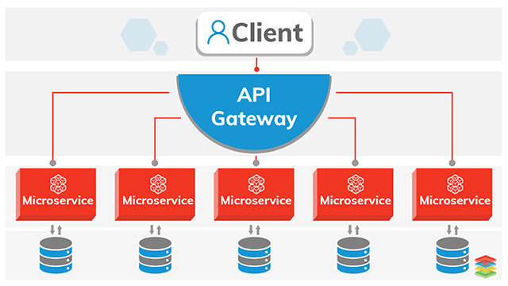

= What is this project

This project was done as a part of 3 *Microservices* project using *Lumen* and *Laradock* demoing the usage of
microservices.

= What is a microservices

Microservices are a software development technique —a variant of the service-oriented architecture (SOA) structural style— that arranges an application as a collection of loosely coupled services.[1] In a microservices architecture, services are fine-grained and the protocols are lightweight.
https://en.wikipedia.org/wiki/Microservices

This is being to decouple systems and avoid single points of failuers and faster development and deployment and scalability.
____

Lumen is designed for building lightning fast micro-services and APIs

____

*Laradock* is a full PHP development environment for Docker that Includes prepackaged Docker Images, all preconfigured to provide a wonderful PHP development environment. Laradock is well known in the Laravel/lumen community, as the project started with single focus on running Laravel projects on Docker.

== Useful Links

* https://laradock.io/[Laradock]
* https://lumen.laravel.com/[Lumen]

== Requirements

To be able to run this project one needs the following technologies:

* https://www.docker.com/[Docker] -&gt; Laradock uses Docker
* https://getcomposer.org/[Composer] -&gt; No need if one uses Laradock/Docker

if one want to start Lumen from scratch Composer is need as a package manager.

== Instructions
. clone the first microservice `https://github.com/ahmedalaahagag/books-microserivce` follow the readme instructions section.
. clone the second microservice `https://github.com/ahmedalaahagag/authors-microserivces` follow the readme instructions section.
. clone the api-gateway microservice `https://github.com/ahmedalaahagag/authors-microserivces` follow the readme instructions section.
. clone the laradock repository from `https://github.com/Laradock/laradock.git`
. now you should have a dir with `Authors`,`Books`,`ApiGateWay`,`laradock` dirs inside

== To run this project
. `cd laradock`
. `cp env-example .env`
. Attached is a laradock `docker-compose.yml` file in this repo copy it to `laradock`
. Attached is 3 nginx config files which holds the configs related to each of the microservices `gateway.conf`,`books.conf`,`authors.conf` copy those files to `laradock/nginx/sites`
. `docker-compose up -d nginx mysql phpmyadmin workspace` =&gt; To start the server
. `docker-compose exec workspace bash` =&gt; to get access to virtual machine and here one can execute any artisan command

Remember all the *Docker* commands have to be run it under *Laradock* folder as there the Docker files are placed.

If one wants to run this project as it is after `composer install` run migration as `php artisan migrate` to update the DB with the right tables. Then seed with `php artisan db:seed` to populate the DB with some fake data.

== Adding a new microservice
After writing your microservice code

. Add the new nginx config file like `gateway.conf` and change the port number inside the new file
ex.`laradock/nginx/sites/newmicroservice.conf`

[source]
----
server {

    listen "81" default_server;
    listen [::]:"81" default_server ipv6only=on;

    # For https
    # listen 443 ssl default_server;
    # listen [::]:443 ssl default_server ipv6only=on;
    # ssl_certificate /etc/nginx/ssl/default.crt;
    # ssl_certificate_key /etc/nginx/ssl/default.key;

    server_name localhost;
    root /var/www/Books/public;
    index index.php index.html index.htm;

    location / {
         try_files $uri $uri/ /index.php$is_args$args;
    }

    location ~ \.php$ {
        try_files $uri /index.php =404;
        fastcgi_pass php-upstream;
        fastcgi_index index.php;
        fastcgi_buffers 16 16k;
        fastcgi_buffer_size 32k;
        fastcgi_param SCRIPT_FILENAME $document_root$fastcgi_script_name;
        #fixes timeouts
        fastcgi_read_timeout 600;
        include fastcgi_params;
    }

    location ~ /\.ht {
        deny all;
    }

    location /.well-known/acme-challenge/ {
        root /var/www/letsencrypt/;
        log_not_found off;
    }
}
----
Change the port to the one that you want the microservice to run on
. in `.env` file add 2 new keys

MICRO_SERVICE_BASE_URI="http://IP_ADDRESS:PORT"
MICRO_SERVICE_SECRET=

Which is how your api gateway gets to your microservice

. in `app/Http/Controllers` dir add the oprations that you want to perform with your api gatway
. in `app/Http/Services` dir add the api call using `ConsumeExternalService` trait or write your own
`ConsumeExternalService` is a guzzle wrapper
http://docs.guzzlephp.org/en/stable/
. in `routes/web.php` add your new routes

And like this you've added a new microservice.

Note : This is not the best practice though read more on service discovery
https://www.nginx.com/blog/service-discovery-in-a-microservices-architecture/
